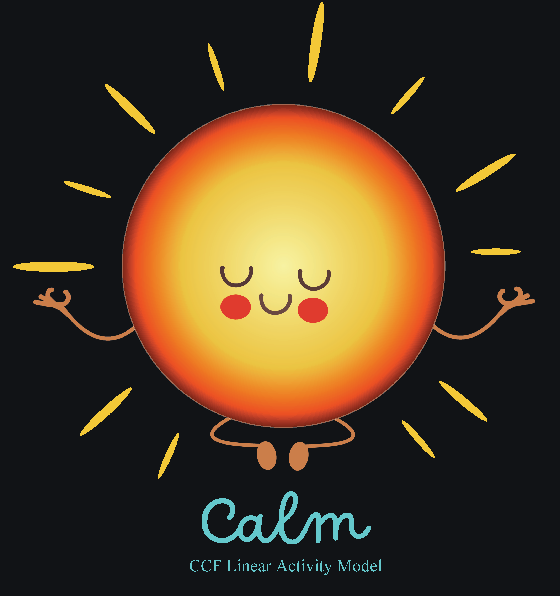

# CALM: CCF Activity Linear Model
 RV orbital fitting software that allows simultaneously fits for stellar variability and Keplerian signals

###### Image created by Zoe L. de Beurs. Inspired by images from [Kahovsky](https://www.vectorstock.com/royalty-free-vectors/vectors-by_kahovsky).

